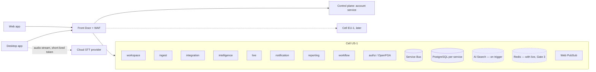

> **Plan document — do not modify.**
> This file is the agreed plan and architecture. Treat it as source of truth.
> Changes must go through a new ADR or an explicit plan revision — do not edit in place.

---

> **Production target** — this is not a prototype or MVP. Every decision here targets a production product shipped in cycles.

# Zedex — Architecture Index

**Updated:** 4 October 2026 · **Status:** approved target architecture, not yet implemented (see [IMPLEMENTATION_STATUS](docs/IMPLEMENTATION_STATUS.md)) · **Cloud:** Azure · **Clients:** macOS/Windows desktop + web (mobile at Gate 6) · **Initial customer:** B2B SaaS, 20–100 employees, English.

## Product in one paragraph

Zedex keeps track of what teams promise in meetings and makes sure it happens. Meetings are grouped by team and Project (user-controlled, multi-membership). Each meeting starts from an agenda agreed by humans and drafted from prior context. During the call, a live panel shows the agenda and open to-dos and suggests which items were discussed; people confirm. Afterwards, decisions and commitments are confirmed, routed to the owning team's tools with exact-payload approval, tracked to delivery, and carried into the next meeting's prep. Missed meetings get a catch-up brief. Lifecycle: `Prep → Capture → Live → Confirm → Approve → Execute → Reconcile → Report → Prep`.

## Non-negotiables

| Area | Rule |
|---|---|
| Media | Text only. Speech-to-text runs on a contracted streaming cloud provider with zero retention; Zedex never stores meeting audio, never uploads audio files, never records, and never joins as a bot. Uncertain values require human verification. |
| Control | AI proposes; humans tick, confirm, close, approve. External writes need exact-payload approval. |
| Access | Every request, event, job, retrieval, citation, report and export is authorized. Association ≠ access. Admins do not see private notes. |
| Calendars | Read-only by default; optional write (codes, agenda) only at Gate 5 with consent. |
| Imports | Text formats only; provider transcript import is admin opt-in (Gate 5). |
| Data | No customer-data training; logs carry IDs, not content; retention and deletion enforced. |

## Architecture style

Right-sized services split on workload and failure boundaries, communicating through an event backbone, deployed as **cells** (Azure "deployment stamps") behind a small global control plane. Decision record and alternatives: [ADR-001](docs/architecture/decisions.md).

| Service | Responsibility | Gate |
|---|---|---|
| account (global) | Users, sessions, workspaces, teams, roles, entitlements, billing, cell directory | 2 |
| workspace | Projects, meetings, notes, agendas, decisions, commitments, routing, codes, audit, deletion | 2 |
| ingest | Desktop transcript sync, revisions, finalization (sharded Postgres) | 2 |
| integration | Calendars, connectors, token vault, webhooks, egress limits | 2 |
| authz | OpenFGA relationship permissions | 2 |
| intelligence | Chunk notes, meeting cards, agenda drafts, preference summaries (Gate 2); briefs, proposals, search/chat, alerts (Gate 3) | 2 |
| live | Low-latency in-meeting suggestions | 3 |
| notification | Email, Slack DM, in-app, timed briefs | 3 |
| reporting | Exports, reports, analytics read models | 3–4 |
| workflow | Workflow DAGs, approvals, operation ledger, canvas backend | 4 |

## Document map

| Topic | Document |
|---|---|
| System overview and flows | [01-overview](docs/architecture/01-overview.md) |
| Desktop app and native capture | [02-desktop-native](docs/architecture/02-desktop-native.md) |
| Services, events, sagas | [03-services-and-communication](docs/architecture/03-services-and-communication.md) |
| Data model per service | [04-data-model](docs/architecture/04-data-model.md) |
| AI pipelines | [05-intelligence](docs/architecture/05-intelligence.md) |
| Calendars and connectors | [06-integrations](docs/architecture/06-integrations.md) |
| Workflows and canvas | [07-workflows-canvas](docs/architecture/07-workflows-canvas.md) |
| Security and privacy | [08-security-privacy](docs/architecture/08-security-privacy.md) |
| Infrastructure and operations | [09-infrastructure-operations](docs/architecture/09-infrastructure-operations.md) |
| Repository structure | [10-repository-structure](docs/architecture/10-repository-structure.md) |
| Quality and testing | [11-quality-testing](docs/architecture/11-quality-testing.md) |
| Decisions (ADRs); current stack in ADR-029 | [decisions](docs/architecture/decisions.md) |
| Delivery gates and cycles | [DELIVERY_PLAN](docs/DELIVERY_PLAN.md) |
| Workflows and discovery kit | [PRODUCT_WORKFLOWS](docs/PRODUCT_WORKFLOWS.md) |
| Market, competitors, parity | [MARKET_RESEARCH](docs/MARKET_RESEARCH.md) |
| All external links | [RESOURCES](docs/RESOURCES.md) |

## Requirement traceability

| Requirement | Where |
|---|---|
| Separate meetings by team; group by user's wish | 03 (workspace), 04, PRODUCT_WORKFLOWS §3 |
| Calendar integration | 06 |
| Missed-meeting context, catch-up, next-meeting prep | 05, PRODUCT_WORKFLOWS §4 |
| AI agenda with user context, editable, human-agreed | 05, PRODUCT_WORKFLOWS §2 |
| Live to-do/agenda panel, tick when discussed | 02, 05 |
| Meeting popup | 02 |
| Tracking codes and attribution | 06, 04, PRODUCT_WORKFLOWS §3 |
| Coverage when owner is absent | 03, PRODUCT_WORKFLOWS §5 |
| Decisions and commitments to delivery | 03, 07 |
| Google Docs and other doc tools | 06 |
| n8n-style canvas | 07 |
| Granola and Fathom parity | MARKET_RESEARCH §4 |
| Scalability | ADR-001, 09 |
| Security, privacy, consent | 08 |
| Production-grade engineering rules | [AGENTS.md](AGENTS.md), 11 |
